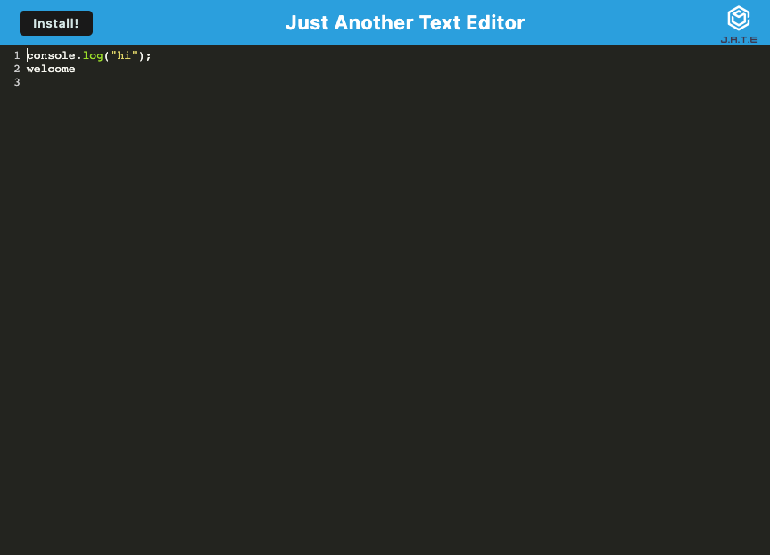

# Text-Editor

## Table of Contents

- [Description of the Project](#description)
- [Installation](#installation)
- [Screenshot](#screenshot)
- [Links](#links)
- [License](#license)

## Description

This is a text editor that runs in the browser. You can create notes or code snippets with or without an internet connection SO THAT You can reliably retrieve them for later use.

## Installation

- Webpack
- Manifest
- IndexedDB
- Node.js
- Express

## Screenshot

## Links

- GitHub: https://github.com/Chenson92/Text-Editor
- Heroku:

## License

This project is licensed under the terms of the MIT license.
[License](https://opensource.org/licenses/MIT)
